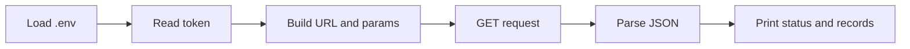

# Pediatric Suicide Methods — Script Documentation (VERSION 2)

## Overview

`pediatric_suicide_methods.py` queries the **CDC injury mortality** dataset via the Socrata Open Data API (SODA). It fetches up to 20 records of **pediatric suicides** (age &lt; 15) and returns selected fields including **injury intent**, **injury mechanism** (method), demographics, and death/population metrics. Output is printed to the console for inspection and reporting.

---

## API Endpoint and Parameters

| Item | Value |
|------|--------|
| **Base URL** | `https://data.cdc.gov/resource/nt65-c7a7.json` |
| **Method** | GET |
| **Auth** | App token in header (see [Usage](#usage)) |

### Query Parameters (SoQL)

| Parameter | Value | Description |
|-----------|--------|-------------|
| `$select` | `year, sex, age_years, race, injury_intent, injury_mechanism, deaths, population, age_specific_rate, unit` | Columns to return |
| `$where` | `injury_intent = 'Suicide' AND age_years = '< 15'` | Filter: suicide, age under 15 |
| `$order` | `year DESC` | Newest years first |
| `$limit` | `20` | Max records returned |

### Headers

| Header | Value | Description |
|--------|--------|-------------|
| `X-App-Token` | *(from `.env`)* | Socrata app token; required for higher rate limits and stable access |

---

## Data Structure

The response is a **JSON array** of record objects. Each record has the following fields (as specified by `$select`):

| Field | Type | Description |
|-------|------|-------------|
| `year` | string/number | Year of the data |
| `sex` | string | Sex (e.g. Male, Female) |
| `age_years` | string | Age group (e.g. `< 15`) |
| `race` | string | Race category |
| `injury_intent` | string | Intent (e.g. Suicide) |
| `injury_mechanism` | string | Mechanism/method of injury |
| `deaths` | number | Number of deaths |
| `population` | number | Population for rate denominator |
| `age_specific_rate` | number | Age-specific rate |
| `unit` | string | Unit for rate (e.g. per 100,000) |

Example record (structure only):

```json
{
  "year": "2020",
  "sex": "Male",
  "age_years": "< 15",
  "race": "...",
  "injury_intent": "Suicide",
  "injury_mechanism": "...",
  "deaths": 123,
  "population": 12345678,
  "age_specific_rate": 0.99,
  "unit": "per 100,000"
}
```

---

## Flow Diagram

Script flow from env load to output:



---

## Usage

### Prerequisites

- Python 3 with `requests` and `python-dotenv` installed:

  ```bash
  pip install requests python-dotenv
  ```

- A **Socrata app token** for `data.cdc.gov`. Request one at [https://data.cdc.gov/profile/edit/developer_settings](https://data.cdc.gov/profile/edit/developer_settings).

### Configuration

1. In the same directory as the script (or project root), create a `.env` file.
2. Add your app token:

   ```env
   SOCRATA_APP_TOKEN=your_token_here
   ```

3. Do not commit `.env`; keep it in `.gitignore`.

### Run the script

From the repo root or from `01_query_api/`:

```bash
python 01_query_api/pediatric_suicide_methods.py
```

Or from inside `01_query_api/`:

```bash
python pediatric_suicide_methods.py
```

### Expected output

- `HTTP status code: 200`
- `Number of records returned: 20` (or fewer if fewer matches)
- `Keys in first record: ['year', 'sex', ...]`
- First 3 records printed as dictionaries

If the token is missing, the script raises `ValueError: Missing SOCRATA_APP_TOKEN in .env`. If the request fails, it prints a truncated error body and re-raises the exception.
