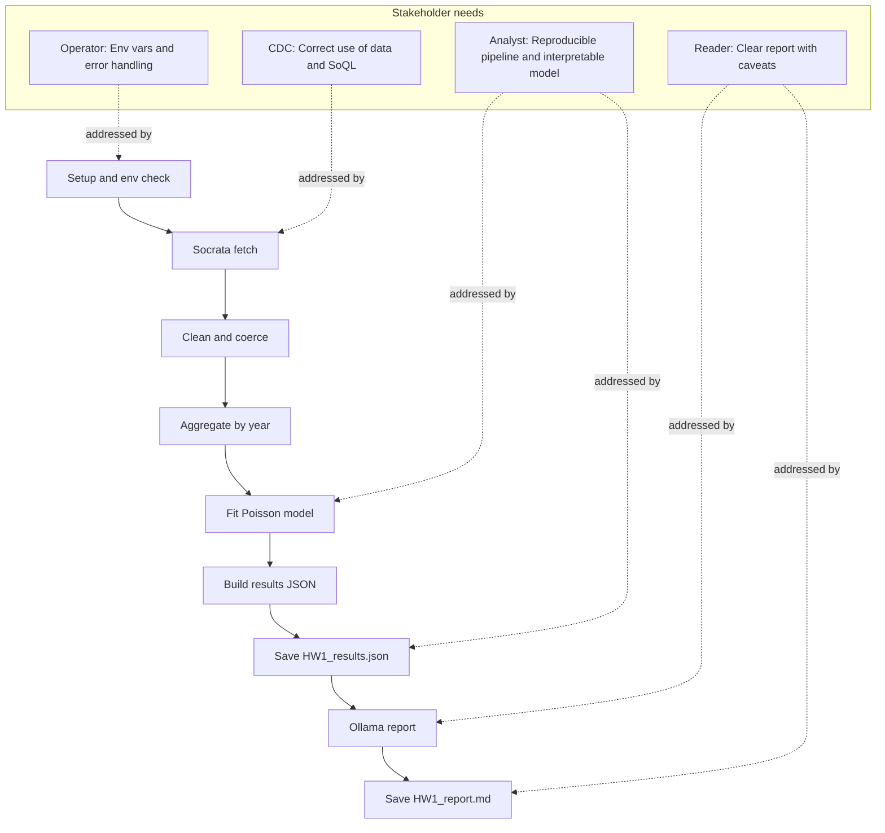

# HW1 Pipeline – Process Diagram with Stakeholder Needs

Copy the code below and paste it into [Mermaid Live Editor](https://mermaid.live). Paste only the lines inside the code block (from `flowchart TB` down to the last line); the site expects raw Mermaid, so omit the surrounding triple-backtick fences.

