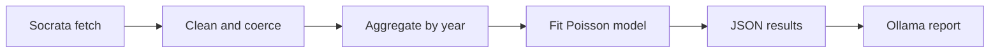

# SIMPLE – How to Run HW1 and What It Does

## How to launch (do this in order)

1. **Open a terminal** and go to your project root (the folder that contains `03_query_ai`).

2. **Start a virtual environment** (recommended if your IDE or system asks for one). Run these in your **terminal** (the shell where you type commands like `cd` and `ls`), **not** inside the Python interpreter:
   ```bash
   python3 -m venv .venv
   source .venv/bin/activate
   ```
   Type each line and press Enter. Your prompt should then start with `(.venv)` and show a path (e.g. `(.venv) mjt@Matthews-MacBook-Air dsai %`). If you see `>>>` instead, you are inside Python — type `exit()` and press Enter, then run the two commands above again in the terminal. (To leave the venv later: `deactivate`.)

3. **Create a `.env` file** with your API keys. Put it in the **project root** (same level as `03_query_ai`) or inside `03_query_ai/`. Use exactly these names (no spaces around the `=`):
   - `SOCRATA_APP_TOKEN=your_token_here`
   - `OLLAMA_API_KEY=your_key_here`
   Replace the values with your real tokens. You need a CDC Socrata app token and an Ollama Cloud API key (get them from the course or provider sites). If you see "OLLAMA_API_KEY not set", the file is in the wrong place or the variable name is misspelled.

4. **Install dependencies** (one time). With the venv active (or from project root):
   ```bash
   pip3 install -r 03_query_ai/requirements.txt
   ```
   Or from inside `03_query_ai/`: `pip3 install -r requirements.txt`  
   (If `pip3` is not found, try `python3 -m pip install -r requirements.txt`.)

5. **Run the script** from the project root (with venv active if you use one):
   ```bash
   python 03_query_ai/HW1.py
   ```

6. **Find the outputs** in the `03_query_ai/` folder:
   - `HW1_results.json` – the numbers and model results
   - `HW1_report.md` – the AI-written report

If something breaks, the script will print which step failed and a short message about what to fix.

---

## ELI5: What is happening?

- **Step 1 – Socrata fetch**: We ask the CDC’s website for data about kids and suicide. They send back a list of rows (year, method, number of deaths).

- **Step 2 – Clean and coerce**: We turn those rows into a proper table and make sure years and death counts are real numbers with no missing or weird values.

- **Step 3 – Aggregate by year**: We add up all the deaths for each year so we have one total per year.

- **Step 4 – Fit Poisson model**: We run a Poisson regression (a model for counts) so we can say “on average, how does the number of deaths change per year?” We get a rate ratio (e.g. “about X% more per year”) and a p-value.

- **Step 5 – JSON results**: We put the yearly totals and the model answer (rate ratio, p-value, etc.) into a JSON file so we can save it and send it to the AI.

- **Step 6 – Ollama report**: We send that JSON to Ollama Cloud. The AI reads it and writes a short report in plain English (what the trend is, main findings, and a cautious recommendation). We print that and save it as `HW1_report.md`.

**In one sentence**: We get CDC data, clean it, add it up by year, fit a Poisson model, then ask an AI to explain the results in plain language and save that as a report.


